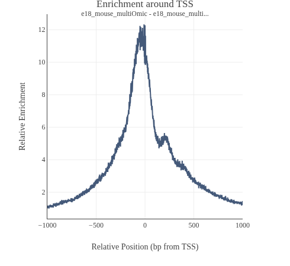
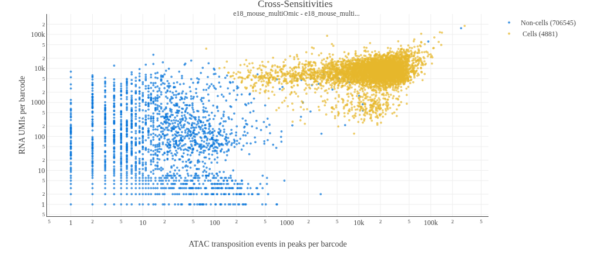
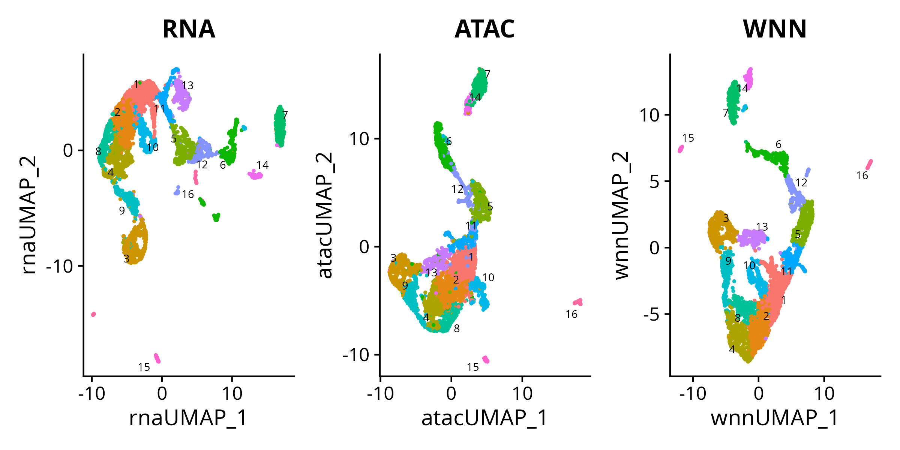
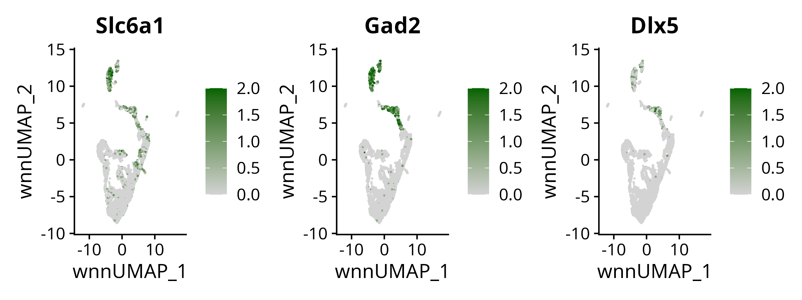
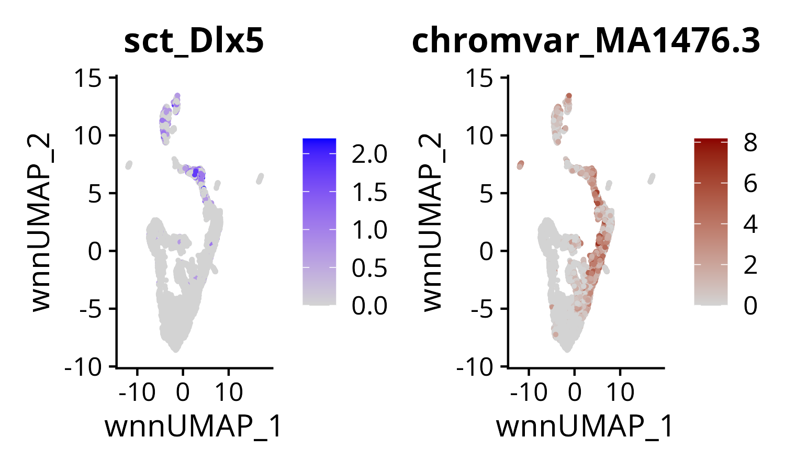
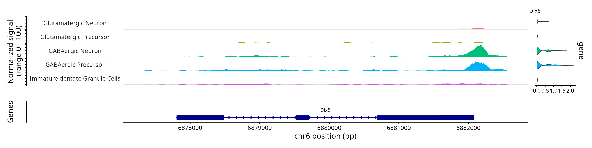
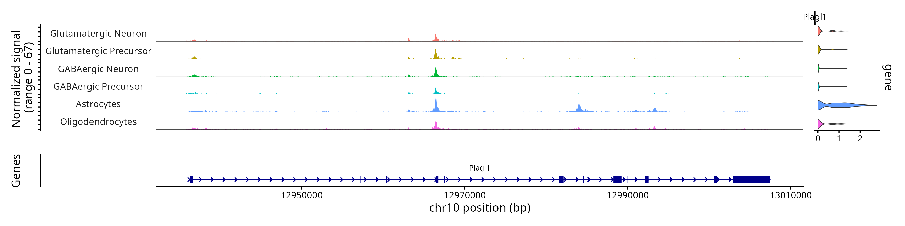

# Mouse Brain - Single Cell Multiome ATAC + Gene Expression

## Overview

This repository demonstrates a workflow for the analysis of a multi-omics experiment interrogating chromatin accessibility and gene expression of the murine brain starting from raw fastq files all the way to downstream analysis. I use the Weighted Nearest Neighbour (WNN) method from the Seurat package to integrate expression and accessibility data for dimensionality reduction, cluster annotation, and finally the identification of features putatively interesting for cell fate decisions.

This is intended as an exploratory analysis that serves only as a starting point for further analysis depending on the scientific question of the study.

This readme file contains the main points of the analysis. The analysis is divided into three R-markdown files that are annotated with details and contain the exact executed code and session info. I have omitted the raw data and large files from this repository to maintain a tolerable size.

## Data

The data for this analysis is from 10x Genomics and can be found within their datasets archive under the name 'Fresh Embryonic E18 Mouse Brain (5k)'. This experimental data contains scRNA and scATAC-seq read outs from the same nucleus and was created using the 10x 'Epi Multiome ATAC + Gene Expression' protocol. The subject tissue is the brain of an 18 day old mouse embryo. We are therefore dealing with embryonic cells during late gestation that are in varying stages of differentiation which is going to become evident in the analysis below.

## Workflow overview

1. Align and create count/fragment table

2. Seurat WNN dim reduction

3. Cluster - Cell type association

4. Identify transcription factor Expression and Motif accessibility as cell type markers

### indexing of the mouse reference genome

```{bash}
cellranger-arc mkref --config data/GRCm39_config.txt --nthreads=16 --memgb=22
```

### align and count

```{bash}
cellranger-arc count \
  --id e18_mouse_multiOmic \
  --reference data/GRCm39/ \
  --libraries data/raw_data/e18_mouse_brain_library.csv \
  --create-bam true \
  --localcores 16
```

### Quality Control - cellranger output

Unsurprisingly, the data deposited by 10x Genomics is of high quality. Both subexperiments had a high number of confidently mapped reads to the mouse genome (>92%). There is a median count of 16,478 ATAC fragments and 3,134 genes per cell, respectively. De-duplication and cell/non-cell boundaries are calculated internally in the cellranger suite, the latter using the ordmag algorithm followed by clustering to account for the spread of ATAC+GeneExpression data.

There is a clear association of scATAC-seq reads with Transcription Start Sites (TSS) of genes, and in most cell barcodes the fraction of reads mapping to peaks is over 0.5. Therefore, the ATAC experiment produces fragments that mostly accumulate in the form of peaks at accessible sites within the genome.


|                                 |                                                             |
| ------------------------------- | ----------------------------------------------------------- |
|  |  |

Similarly, the combined look at the RNA-seq and scATAC data shows most cells simultaneously having a high number of transposition events (ATAC) and a high number of UMIs (RNA).



## Dimensionality reduction and Clustering

Here, I use the Weighted Nearest Neighbor (WNN) method in Seurat to jointly embed gene expression and ATAC profiles for each cell and perform integrated clustering. WNN is a multimodal integration approach that jointly analyzes multiple modalities, such as gene expression and ATAC. Instead of concatenating features across modalities, WNN constructs separate neighbor graphs for each modality and learns cell-specific weights. For each cell, these weights quantify how well a given modality captures local neighborhood structure. The modality-specific graphs are then combined into a single weighted neighbor graph, which balances contributions from each modality on a per-cell basis. I then use the graph for Leiden clustering, which resulted in 16 clusters with varying sizes from 558 to 36 cells.

Below is a UMAP visualization of RNA (PCA), ATAC (TF-IDF), and the integrated WNN graph, with cells colored by cluster (16 total). At first glance, the WNN embedding appears similar to the ATAC visualization, likely due to their shared orientation and the presence of elongated regions corresponding to clusters 12 and 6. However, the WNN representation integrates information from both RNA and ATAC modalities. For example, clusters 7 and 14 are nearly indistinguishable in the ATAC embedding but are clearly separable based on gene expression. In this case, the WNN graph assigns greater weight to the RNA modality when defining the local neighborhood structure of these clusters.



## Cell type assignment

For cell type assignment I performed a differential expression analysis to find differentially expressed genes for every cluster. I then utilized the marker gene list for the brain from sc-type (https://github.com/IanevskiAleksandr/sc-type/) to make informed decisions about cell identities. In short, I checked each cluster for expressed marker genes and checked their differentiation status by assessing their representation in the RNA and WNN UMAP. As an example, here is the expression of Slc6a1 (neurotransmitter transporter, GABA), Gad2 (glutamate decarboxylase), and Dlx5 (transcription factor). The first 2 genes are markers of GABAergic neurons, whereas Dlx5 is a transcription factor associated with development.



The clusters associated with high Slc6a1 and Gad2 expression are therefore likely to be GABAergic neurons or precursors thereof. I continued with the rest of the clusters and the available marker genes from sc-type and concluded with the cluster identification found below. Since, mainly the gene expression was used for cell type identification, I included the RNA and WNN UMAPs colored by cell identity. For simplicity's sake I collapsed multiple clusters into cell types. Same cell types might end up in different clusters due to, e.g., brain region the cells originated from.


The more differentiated neurons (GABAergic and Glutamatergic) both originate from a pool of undifferentiated Neuroblasts. Cells are being captured during different stages of differentiation, leading to lanes/necks of cells in the UMAP representation leading from the pool of Neuroblasts to the more differentiated cell types. Limitation: with more time and exchange with murine development experts a more complete assignment of clusters to different precursor stages could be made. Cajal cells (interneurons) appear very distinct from the large pool of developing neurons. Unsurprisingly, Microglial cells also cluster far from the main body of cells, attributable to their different origin.


## Transcription factor / Motif analysis

Lastly, I leverage the modalities of ATAC peaks and Gene expression to identify enriched transcription factor (TF) motifs and the associated TF expression to identify intriguing genes for cell type development. The latest version (2024) of JASPAR is used to get a list of TF motifs and chromVAR is used to find differentially accessible motifs in the assigned cell types. The Area Under Curve (AUC) of every TF expression/motif accessiblity pair is used to rank the marker TFs. The associated table can be found under 'data/celltype.motif.markers.csv'. Here, I show two examples. This framework can be readily extended to address a broad range of regulatory and developmental questions.

### Dlx5

Dlx5 is identified as a marker for GABAergic Neurons in this analysis. It is a member of the DLX gene family that encompasses multiple homeobox transcription factors. Mutations of it are associated with the split hand and foot malformation syndrome. It is known to be expressed in the brain, however a function specific to GABAergic neurons is not known. Its expression and TSS accessibility are only high in GABAergic Neurons or Precursors thereof.





### Plagl1

Plagl1 is identified as a marker for Astrocytes in this analysis and stands out with an average AUC of 0.85. It is associated with neural development in mice, but its association with astrocytes in particular appears to be not described. Additionally, the ATAC profile shows its Transcrption Start Site (TSS) not being more accessible than other cell types, however it is distinguished by multiple peaks within exons. This might be a hint for this gene's expression being regulated on the RNA level by alternative splicing mechanisms.



